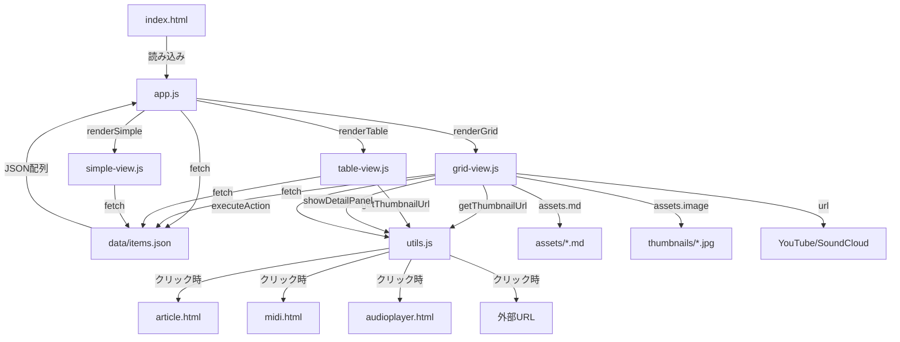
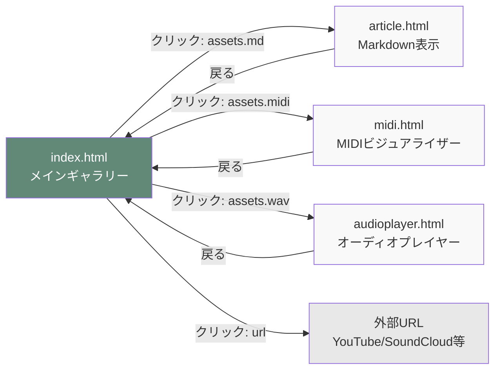
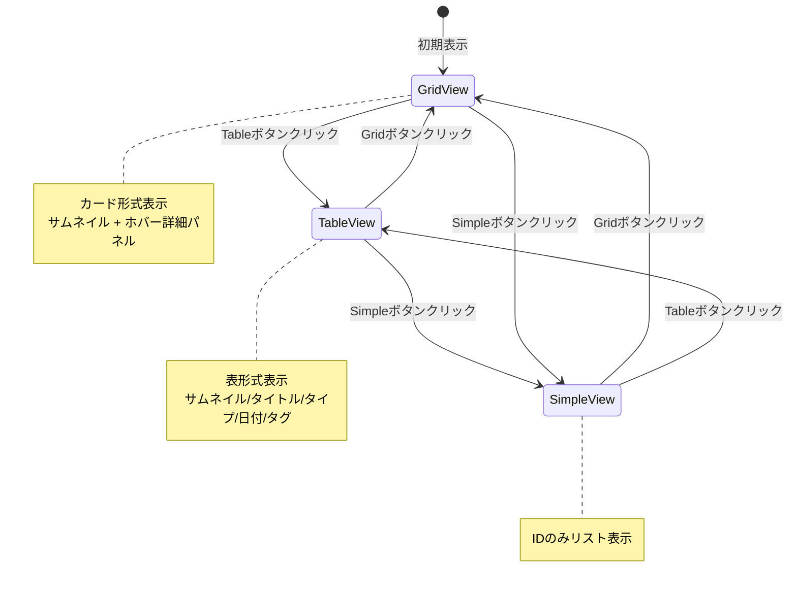
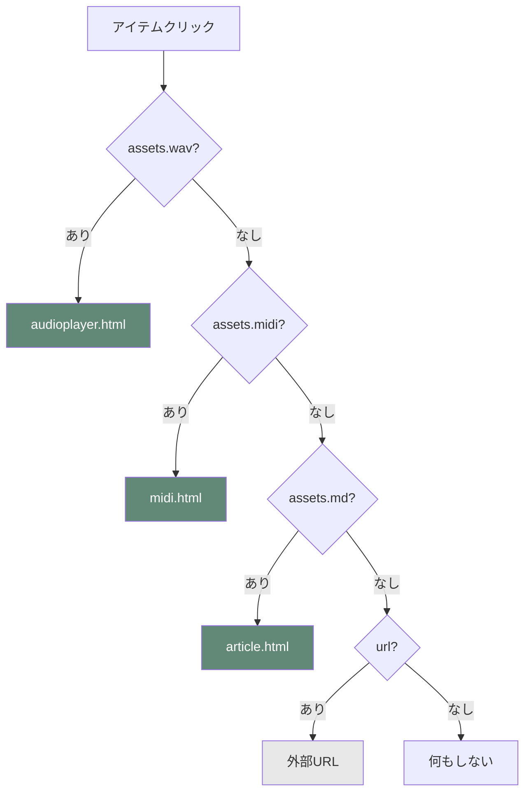
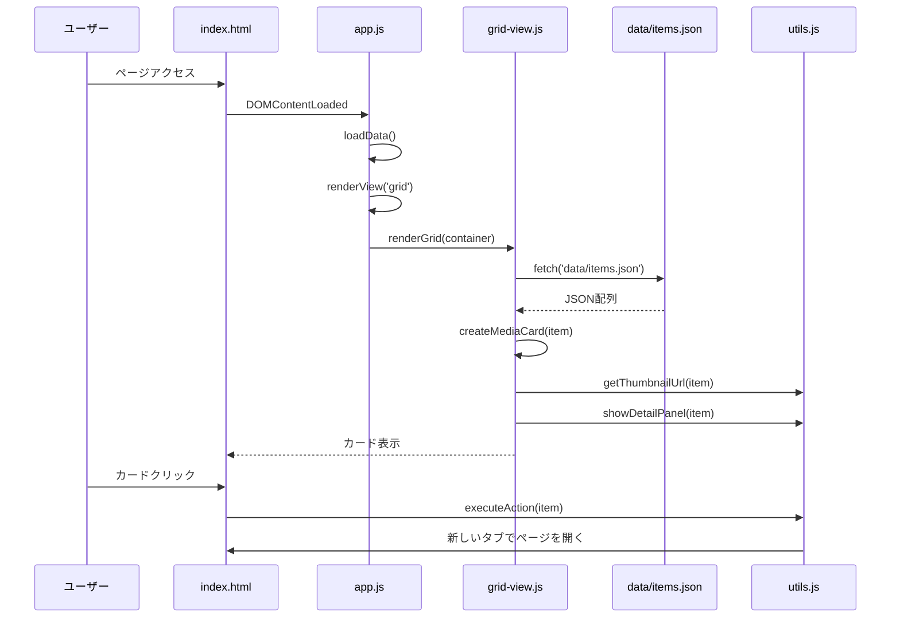
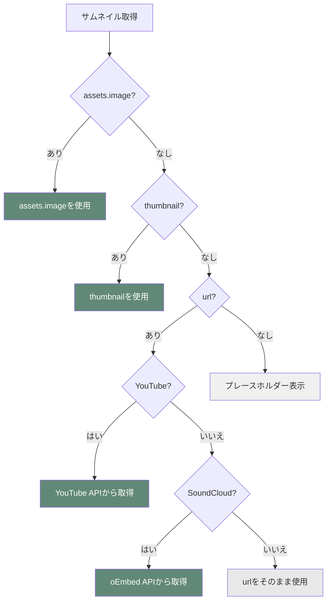

# nattsu Gallery - 構造図・遷移図

## ページ構造図

```
┌─────────────────────────────────────────────────────────┐
│                    index.html                            │
│  ┌───────────────────────────────────────────────────┐  │
│  │  Header                                           │  │
│  │  - タイトル: "nattsu Gallery"                     │  │
│  │  - ビュー切り替え: Grid / Table / Simple         │  │
│  │  - 設定: Size / Background / Font                 │  │
│  └───────────────────────────────────────────────────┘  │
│                                                          │
│  ┌───────────────────────────────────────────────────┐  │
│  │  Main Area                                        │  │
│  │  ┌─────────────┐  ┌─────────────┐  ┌──────────┐ │  │
│  │  │ Grid View   │  │ Table View  │  │ Simple   │ │  │
│  │  │ (default)   │  │ (hidden)    │  │ (hidden)  │ │  │
│  │  └─────────────┘  └─────────────┘  └──────────┘ │  │
│  └───────────────────────────────────────────────────┘  │
│                                                          │
│  ┌───────────────────────────────────────────────────┐  │
│  │  Detail Panel (右側からスライドイン)              │  │
│  │  - タイトル / タイプ / 概要 / 日付 / タグ         │  │
│  └───────────────────────────────────────────────────┘  │
└─────────────────────────────────────────────────────────┘
```

## データフロー図



## ページ遷移図



## ビュー切り替えフロー



## アセットタイプとクリック動作の優先順位



## ファイル構造

```
nattsu-gallery/
├── index.html              # メインページ
├── article.html            # Markdown記事表示ページ
├── midi.html              # MIDIビジュアライザー（将来）
├── audioplayer.html       # オーディオプレイヤー（将来）
├── app.js                 # メインアプリケーション
├── styles.css             # スタイル
├── js/
│   ├── grid-view.js       # Grid View実装
│   ├── table-view.js      # Table View実装
│   ├── simple-view.js     # Simple View実装
│   └── utils.js           # 共通ユーティリティ
├── data/
│   └── items.json         # メタデータ（必須: idのみ）
├── assets/
│   ├── *.md              # Markdownファイル
│   ├── *.midi            # MIDIファイル（将来）
│   └── *.wav             # WAVファイル（将来）
└── thumbnails/
    └── *.jpg, *.png      # サムネイル画像
```

## データ読み込みフロー



## サムネイル取得の優先順位


